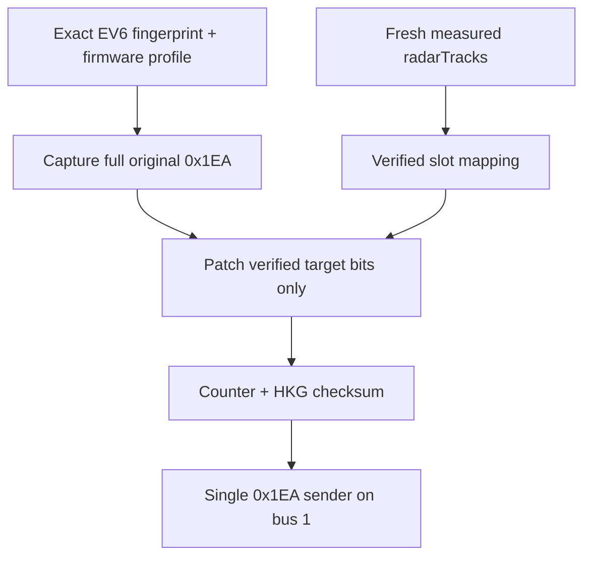

# Kia EV6 factory-cluster side vehicles

## Delivery status

The display-only transport, evidence analyzer, independent setting, status reporting, stale-data handling, and collision protection are implemented. Live EV6 target injection is intentionally disabled: no synchronized on-road factory-cluster video/CAN capture or exact combination-meter firmware was available, so `VERIFIED_PROFILES` is empty. On the current evidence, the setting reports **firmware and CAN profile not verified** and sends no additional cluster target.

This is a safety boundary, not an assumption that the car is ccNC or that its corner radars are disabled.

## Pinned sources

| Source | Revision examined | Finding used here |
|---|---|---|
| [`TonyBinheWu/sunnypilot:hkg-enhanced`](https://github.com/TonyBinheWu/sunnypilot/commit/e5144fad114b0dda6a288b5506df8d9531090f63) | `e5144fad114b0dda6a288b5506df8d9531090f63` | Target base before this change |
| [`TonyBinheWu/opendbc:hkg-enhanced-lfa`](https://github.com/TonyBinheWu/opendbc/commit/8c049b99985f40b6833a25e6209f1f0ecf9d6d44) | `8c049b99985f40b6833a25e6209f1f0ecf9d6d44` | HDA2 bus mapping, ECU disable path, current `0x1EA` generator, candidate DBCs, and Panda safety policy source |
| [`sunnyhaibin/panda`](https://github.com/sunnyhaibin/panda/commit/74a0adced421e8b7acd728d0f9988ce225423f13) submodule | `74a0adced421e8b7acd728d0f9988ce225423f13` | Panda transport/runtime revision used by the target branch; unchanged by this work |
| [`sunnypilot/dev-chestnut`](https://github.com/sunnypilot/sunnypilot/commit/0e51ecbb7efc004c81cb640500a4d886f3ebb9c5) | `0e51ecbb7efc004c81cb640500a4d886f3ebb9c5` | Same HDA2 `0x730` disable plus fixed-field `0x1EA` replacement; no verified EV6 side-target restoration to transplant |
| [`huheas/carrotpilot:carrot2-v9`](https://github.com/huheas/carrotpilot/tree/baccd3446c1e11c1146c22d0aece3112ea50a0a8) | `baccd3446c1e11c1146c22d0aece3112ea50a0a8` | Candidate `0x1EA`/`0x162` receive-copy-patch approach and wiring-dependent bus choices |
| [Carrotpilot manual](https://g4iwnl.gitbook.io/carrotpilot) | source reviewed 2026-09-10 | HDA2 modification uses changed ADAS E-CAN wiring and cannot define Hyundai P bus routing |

## Cause analysis

### Proven from source

- On HDA2 with openpilot longitudinal control, the Hyundai interface disables ADAS Driving ECU `0x730` on E-CAN unless Camera SCC or enhanced SCC changes the path.
- The controller then calls `create_adrv_messages`; its default `0x1EA` is emitted every fifth 100 Hz control frame (20 Hz) with only fixed compatibility fields populated. The target fields are not populated in the target branch's DBC.
- The target opendbc safety policy loaded by Panda already permits HDA2 longitudinal `0x1EA`, length 32, on bus 1. It does not authorize the candidate `0x161`, `0x162`, or `0x4A3` outputs. This change does not add those messages to the allowlist.
- `0x1BA` is already decoded as left/right blind-spot state. It is a regional Boolean/status source, not a measured distance.
- `0x1E0` in this codebase carries LFA/HDA cluster-icon state. There is no verified side-target position decode in it.

### Strong source-code hypothesis, pending the car log

The most likely loss mechanism is that disabling `0x730` removes an original target-bearing ADRV stream and the replacement `0x1EA` keeps the ECU network satisfied but omits object data. This explains the symptom without asserting that a corner sensor is powered off. It is not yet a verified cause for this EV6 because sender, physical bus, cluster receiver, firmware, and screen correlation remain unobserved.

Experimental Mode may be coincidental or may alter a display-state prerequisite. Only the `sp_long_exp_off` versus `sp_long_exp_on` driving comparison can separate it from the longitudinal takeover.

## Candidate message matrix

| ID | What the current sources show | Production status |
|---:|---|---|
| `0x1BA` | Current DBC/CarState provides left/right BSM state | Receive-only context; never converted to precise position |
| `0x161` | Carrot candidate includes lane, LCA icon, alert and fault/display fields | No EV6 layout/bus proof; no transmit permission |
| `0x162` | Common DBC and carrot contain front/rear target fields, but their rear layouts differ | Offline correlation only; do not infer ccNC |
| `0x1E0` | Current target uses LFA/HDA icon state | No side-target proof |
| `0x1EA` | Current HDA2 longitudinal replacement exists; carrot assigns front target hypotheses | Only possible live transport, still blocked until exact profile proof |
| `0x4A3` | Carrot treats it as HDA/navigation information and contains debug mutations | Offline navigation candidate only; no value, length, bus, or receiver assumed |

Carrot's pattern is useful because it retains an existing message dictionary and edits target fields. Its exact implementation is not accepted as evidence for this vehicle: the manual describes an HDA2 harness modification, Camera SCC affects the receive path, and the `0x162` code inserts a fixed 2 m rear distance for a test target. That fixed value is expressly excluded here.

## Implemented data path

- The raw original payload is observed before the HDA2 ECU-disable request, including unknown, fault, alert, and mode bits.
- A fresh original sender on the destination bus wins; sunnypilot suppresses its normal blank `0x1EA` instead of competing.
- A source on a separately verified bus can be forwarded byte-for-byte, with only counter/checksum updated as required.
- A stale original frame can become a template only when the profile contains evidence that non-target fields are safe and static. Otherwise output stops.
- A replacement after takeover is built from the full validated template. Only profile-listed detection/distance/lateral bits, counter, and checksum can change.
- Only finite, `measured=true`, same-generation, fresh `radarTracks` points can enter the display path. They are copied into `CarControlSP` and are not added to `radarState`, planning, lane-change logic, steering, acceleration, or braking.
- No target or stale radar data writes a profile-verified neutral value; no fake vehicle is generated. BSM input is discarded by the precise-position path.
- If the original sender reappears after takeover, a conflict latch suppresses the replacement. Recovery requires a restart; it never continues two same-ID senders.

The manager validates length, HKG checksum, timestamp age, exact firmware, source/destination buses, 20 Hz schedule, neutral values, detect codes, target zones, and production authorization before enabling. The setting cannot bypass these checks.

## User setting and statuses

`HkgFactorySideVehicleDisplay` is an independent Visuals toggle visible only for a detected Kia EV6 CAN-FD HDA2/LKA-steering candidate. It does not enable Kia automatic lane change. `HkgFactorySideVehicleDisplayStatus` reports the reason, including unsupported vehicle, unverified firmware/profile, missing/invalid/stale original template, stale real targets, unsupported message, original-sender conflict, stock passthrough, real targets, and no targets.

With the current empty profile registry, the expected result is `unavailable_unverified_profile`. That is the correct fail-closed result until vehicle evidence is supplied.

## Navigation/highway-state scope

`tools/hkg_factory_cluster/ev6_factory_cluster.py` supports three research plan modes:

- `original_navigation`: reproduce only exact received bytes and timing;
- `complete_navigation`: gated by proof that the captured sequence is complete;
- `fixed_highway`: gated by proof of the exact vehicle-specific highway value.

The tool never transmits. It generates a reviewable plan, hashes its source capture, requires exact transport allowlisting for bench authorization, and always leaves vehicle authorization false. No runtime navigation/highway sender is included because there is no evidence that such state affects only the cluster. If later testing shows it changes ADAS enable conditions, that approach must remain rejected and a cluster-only field must be found.

## Validation completed

- Raw-frame tests prove all bits outside the authorized target fields, counter, and checksum remain identical.
- Profile tests cover exact firmware gating, cached-template proof, controller-rate enforcement, neutral encodings, stale target handling, BSM non-conversion, and sender-conflict latching.
- Offline tool tests cover three-scenario comparison, checksums/counters/video labels, byte-exact original navigation plans, transport-hash matching, and mode-specific complete/fixed-highway evidence gates.
- The Hyundai non-safety regression suite passes unchanged behavior outside this opt-in path.

These are offline/software results only. No factory-cluster graphic has been claimed as verified.

## Required on-vehicle acceptance

1. Identify exact EV6/cluster/head-unit/ADAS firmware and confirm the fingerprint is not fuzzy.
2. Capture the three synchronized driving scenarios described in [`tools/hkg_factory_cluster/README.md`](../tools/hkg_factory_cluster/README.md). Do not use parking as the primary verdict.
3. Prove which physical RX bus through the installed Hyundai P carries each candidate and whether `0x730` disable removes it.
4. Correlate each proposed target field with a real left/right vehicle entering, moving, and leaving; prove neutral values with no target.
5. Confirm sender, receiver, length, 20 Hz rate, counter, checksum, timeout, and non-target stability.
6. Add one exact firmware profile and repeat offline/process replay with conflict and stale-data cases.
7. Use an isolated ECU bench before any navigation/highway replay. Confirm every ADAS control state is unchanged.
8. Conduct supervised on-road display acceptance with the feature switch on/off and both Experimental Mode states. Any warning/fault, unintended ADAS state, stale graphic, or sender conflict is a failure and must stop testing.
